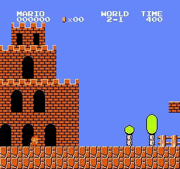

# Some Reinforcement Learning Algorithms to Play Super Mario Bros

## Intro

This is a repo of using some RL algorithms to play super-mario-bros game. 

## demo

- world 1: (stage 1, 2 and 4)

  
  
  

- world 2:(stage 1)

